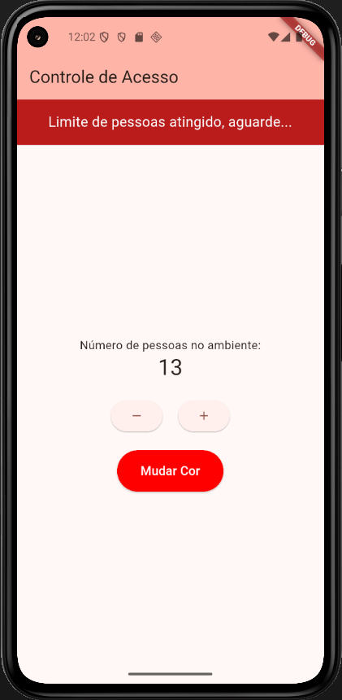

# Access Control App

Um aplicativo Flutter para controle de acesso, simulando a entrada e saída de pessoas em um ambiente. O objetivo principal do aplicativo é gerenciar o número de pessoas em um local, permitindo a configuração de um limite máximo e a simulação de saídas automáticas após um determinado período.

## Matrícula dos Componentes da Dupla
- Eduardo Martins Cardoso
- Breno Tonini Costa

## Captura de Tela do Aplicativo


## Recursos
- Contador de pessoas com limite máximo configurável.
- Simulação automática de saída de pessoas após determinado tempo.
- Mudança de cor dinâmica na interface.

## Instalação 
Siga os passos abaixo para rodar o projeto localmente:

1. Clone este repositório:
```sh
git clone https://github.com/BrenoTonini/access_control_app.git
```
2. Acesse a pasta do projeto:
```sh
cd access_control_app
```
3. Execute o app:
```sh
flutter run
```

## Tecnologias Utilizadas
- Flutter (Framework de UI)
- Dart (Linguagem de Programação)
- Material Design (Interface Moderna)

## Como Usar
- Aperte o botão "+" para adicionar pessoas ao ambiente.
- Quando atingir 10 pessoas, a simulação de saída inicia automaticamente.
- Aperte "Mudar Cor" para alterar a aparência do app.

## Observações

- Este projeto é um exercício acadêmico de aplicativos mobile focado na introdução dos elementos básicos do Flutter, que são fundamentais para o desenvolvimento de interfaces de usuário eficientes e responsivas.
- StatefulWidgets e StatelessWidgets
- Row and Column
- Dentre outros componentes.

## Contribuição

Projeto acadêmico não aberto para contribuições externas. No entanto, sinta-se à vontade para clonar o repositório e realizar modificações para aprendizado pessoal.

---

Desenvolvido como parte da disciplina **Aplicativos Mobile - Faculdade UCL**.
